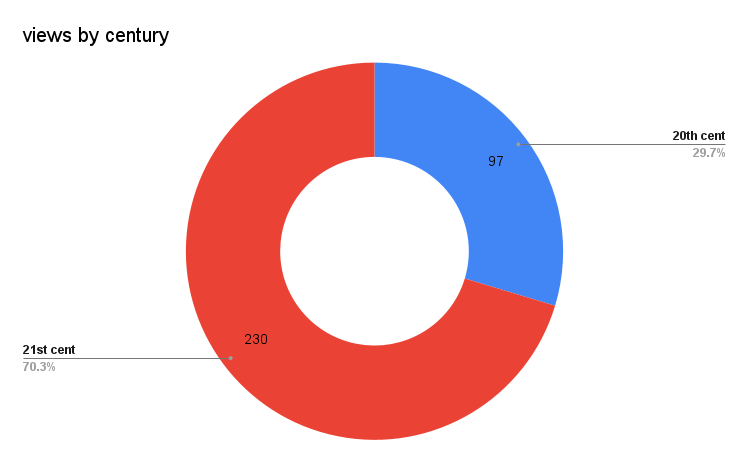

# 2024
2024 was kinda rough. Overall, I think I watched less stuff than I normally would, which makes sense considering how stressful the year was. I definitely craved the outdoors more than being cooped up inside, and generally just found it harder to dedicate time to uninterrupted viewing, especially feature-length titles.

## basic highlights
* **total number of unique titles = 327**
* **total number of unique viewing venues (e.g. streaming platforms, movie theaters) = 31**
* **total number of unique filmmakers = 281**
* **historical range of titles' release date = 1933-2024**
* **first watch = _Close_ (2022, dir. Lukas Dhont, Kanopy)**
* **last watch = _Bird_ (2024, dir. Andrea Arnold, Mubi)**

## by format (shorts vs. feature-length)
* short = <60 min run time
* feat = >60 min run time

This result is pretty unsurprising considering how time-constrained I felt this year, but also reflects an intentional commitment to seek out short experimental work online. More on that discussed in the [by venue](#by-venue) section.

## by century

This outcome trending more toward 21st century titles came as a bit of surprise but makes sense considering the aforementioned intention to seek out experimental work online, which (for me) definitely tends to skew more contemporary than repertory.

I wonder how this would have looked 10 years ago when I was working as a projectionist in a film archive running nitrate and 35mm film 6 nights a week.

## by year
Apologies for the sprawl of the graph shown below. It's difficult to visualize 91 years of viewing range.

Here we see the strongest concentration of titles in 2023 and 2024 that further reflects a bias toward the contemporary for this year.

We can rein this in a bit by grouping into decades.

And get further insight by breaking each decade down by shorts and features.

It isn't super surprising that features edged out shorts in the 1930s, 40s, and 50s. But that fact that only one 80s short made it in at all seems a little odd. That one was [_From the Reports of Security Guards and Patrol Services No. 1_](https://mubi.com/en/us/films/from-the-reports-of-security-guards-patrol-services-no1) by the great German filmmaker [Helke Sander](https://en.wikipedia.org/wiki/Helke_Sander).

This is also a good reminder to not conflate quantity with quality for any given set of viewing experiences. There were plenty of older shorts that absolutely blew me away that I otherwise would not have had a chance to see if it wasn't for festivals providing a streaming options (e.g. Harun Farocki's _Inextinguishable Fire_ (1969) and Pat O'Neil's _Down Wind_ (1973) at [Media City Film Festival](https://mediacityfilmfestival.com/)) and specialty platforms putting stuff out there (e.g. Craig Baldwin's _Stolen Movie_ (1968) via Canyon Cinema and Bruce Baillie's _Castro Street_ via [PARACME](https://www.paracme.com/)).

## by venue

Looking at this data about where/how I am watching stuff seems pretty revealing. Obviously, I'm favoring a few streaming services--Criterion Channel and Mubi, namely--as these two represent about 28% (n=92) of everything I've watched this year.

Sadly, I only watched about 10% (n=33) of titles in an actual theater, although some of those--e.g. the new restoration of _Paris, Texas_ (1984) in an IMAX auditorium during the [Tallahassee Film Festival](https://tallahasseefilmfestival.com/); seeing _The Substance_ (2024) with a packed, very vocal house--were pretty amazing all the same.

I definitely took advantage of all the time-limited titles [Canyon Cinema](https://canyoncinema.com/) made available, in addition to leaning hard into streaming options provided by film festivals when I could.

I don't really have a lot of access to traditional, in-person venues for this where I currently live (e.g. microcinemas, galleries, etc), so the fact that places like [Antimatter](https://antimatter.squarespace.com/), the [Ann Arbor Film Festival](https://www.aafilmfest.org/), and the [Media City Film Festival](https://mediacityfilmfestival.com/), in addition to temporary and patron-driven offerings via places like [e-flux](https://www.e-flux.com/film/) and the [Canyon Cinema On-Demand](https://www.patreon.com/c/canyoncinema/posts), are providing streaming options is really amazing.

This is _a lot_ of extra work for organizations that are already stretched pretty thin, for sure, but folks like me are hugely appreciative of these efforts and I try to support the festivals in other ways (e.g. donations, buying merch) whenever possible.

Hitting up individual artist Vimeo pages and specialty platforms like [PARACME](https://www.paracme.com/) also gave me plenty of opportunities to deep dive and rabbit-hole in the interest of research/inspiration/nerding out (e.g. [Andrew Kim](https://mubi.com/en/cast/andrew-kim), [Bill Brown](https://www.heybillbrown.com/), [Mary Ellen Bute](http://www.centerforvisualmusic.org/Bute.htm)).

Zooming into just the features, clearly I have a preference for plunging into the depths of Criterion Channel and Mubi (see next section for more on these platforms, specifically). There's some other funny one-off's, here, like watching _Mommie Dearest_ (1981) at my friends' vegetarian restaurant and "fine dive bar," [The Bark](https://barkfl.com/), and _Footprints on the Moon_ (1975) via Shudder, a service I've never really looked into (perhaps to my own detriment).  

A note on "Movie Night" - every Tuesday night a group of us get together to watch a feature (and the occasional short). We rotate who selects the film each week, and the only criteria it needs to meet is that no one (not even the person choosing it) can have seen it already. This proves to be challenging some times as there are eight of us and we're a mixture of nerds/filmmakers/cinephiles/all of the above.

But, when we break through, it usually yields some great results. I saw three of my [favorite films](#top-picks-from-2024) from 2024* because of Movie Night, and generally it gives me an opportunity to see stuff I probably wouldn't otherwise. All to say, this is a highly recommended thing you might want to do with your friends as well.

*_The Last Year of Darkness_ (Ben Mullinkosson), _Queendom_ (Agniia Galdanova), _Leonor Will Never Die_ (Martika Ramierz Escobar)

### criterion channel + mubi by year

I was also curious about how I "treated" Criterion Channel and Mubi, respectively, in terms of what I watched from different years/historical eras. From looking at the data, it's clear I watched a much broader range of titles on Criterion, which spanned from 1933 to 2024.

Compare this to Mubi, where the oldest title is 1970. In the Criterion data we can also see a much more even distribution in the range, whereas with Mubi about 52% of the titles come from the 2020s and only 17.5% comes from the 20th century.  

Broadly, I think it's pretty clear that I'm relying on Criterion for a lot more repertory viewing and Mubi for contemporary stuff. This is not at all surprising considering the curatorial focus of each platform.

## by filmmaker

Of the 281 filmmakers whose work I saw this year, I watched more than 1 title from only 29 of them. [Bill Brown](https://heybillbrown.com/) racked up the most with 16, with [Rose Lowder](https://lightcone.org/en/filmmaker-199-rose-lowder) and [Lawrence Jordan](http://lawrencecjordan.com/) each racking up 10.

## conclusions/resolutions

1. **Conclusion**: Film festivals offering streaming options are incredibly valuable to me, but I worry about the sustainability of it in increasingly austere times.

2. **Resolution**: Go see more movies in-person. I worked in theaters for years and it's just dumb/lazy that I don't make the effort to support them more proactively.

3. **Resolution**: Stay on top of time-limited releases on platforms like e-flux, LUX, etc. more effectively. I can't count how many times I've kicked myself for missing out on this kind of thing.

## top picks from 2024
Presented alphabetically and unconfined by sequential ranking and pre-determined list size as such restrictions are arbitrary and boring.

### shorts
* A Black Screen Too (Rhayne Vermette)
* A Move (Elahe Esmaili)
* A Movement Against the Transparency of the Stars of the Seas (Esy Casey)
* Aliados (Azucena Losana)
* Hey Sweet Pea (Alee Peoples)
* Light Noise Smoke and Light Noise Smoke (Tomonari Nishikawa)
* My Morning with Magic Mike (John Wilson)
* Night Trawler (Michael Fleming)
* phantoms (Scott Northrup)
* The Motherfucker’s Birthday (Saif Alsaegh)  
* The Winged Stone (Colectivo los Ingrávidos)

### features
* Anora (Sean Baker)
* Bird (Andrea Arnold)
* Bottoms (Emma Seligman)
* Do Not Expect Too Much from the End of the World (Radu Jude)
* Fallen Leaves (Aki Kaurismäki)
* La Chimera (Alice Rohrwacher)
* Leonor Will Never Die (Martika Ramirez Escobar)
* Los Colonos (Felipe Gálvez Haberle)
* Mars Express (Jérémie Périn)
* Mountains (Monica Sorelle)
* Queendom (Agniia Galdanova)
* The Beast (Bertrand Bonello)
* The Last Year of Darkness (Ben Mullinkosson)

[back](./)
